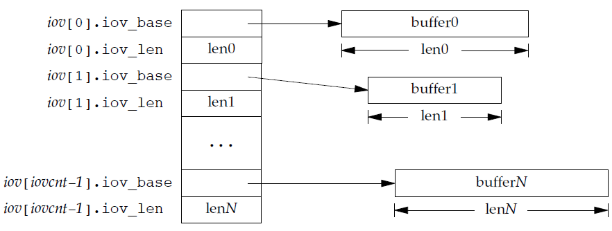

# 高级I/O:

>  系统调用可以分为两类：“低速系统调用”和其他，低速系统调用是可能使进程永远阻塞的一类系统调用

## 一、非阻塞I/O:

> 非阻塞IO也就是当读取或者写低速设备时候，设备没有准备好的时候，读写函数直接错误返回，表示如果函数继续执行下去，那么将阻塞。

##### 1.1 低速系统调用

* 如果某些文件类型（如管道、终端设备和网络设备）的数据并不存在，读操作可能会使调用者永久堵塞
* 如果数据不能被相同的文件类型立即接受（如管道中无空间、网络流控制）、写操作可能会使调用者永久阻塞
* 在某种条件发生之前打开某些文件类型可能会发生阻塞（如要打开一个终端设备，需要先等待与之连接的调制解调器应答，又如若以只写模式打开FIFO，那么在没有其他进程已用读模式打开该FIFO时也要等待）
* 对已经架设强制性记录锁的文件进行读写
* 某些ioctl操作
* 某些进程间通信函数

虽然读写磁盘文件会暂时阻塞调用者，但并不能将与磁盘I/O有关的系统调用视为“低速”

***

##### 1.2 非阻塞I/O

> 我们可以发出open、read和write这样的I/O操作，并使这些操作永远不会阻塞。如果这些操作不能立即完成，则调用立即出错返回，表示该操作如继续执行将阻塞。对于一个给定的描述符，有两种为其指定非阻塞I/O的方法：

对于一个给定的描述符，两种方法指定非阻塞I/O的方法：

（1）如果调用open获得描述符，则可以指定O_NONBLOCK标志；

（2）对于一个已经打开的描述符，则可以调用fcntl改变已经打开的文件属性，由该函数打开O_NONBLOCK标志。

```c
#include "apue.h"
#include <errno.h>
#include <fcntl.h>
char buf[500000];
int
main(void)
{
    int ntowrite, nwrite;
    char *ptr;
    
    ntowrite = read(STDIN_FILENO, buf, sizeof(buf));
    fprintf(stderr, "read %d bytes\n", ntowrite);
    
    set_fl(STDOUT_FILENO, O_NONBLOCK); /* set nonblocking */
    
    ptr = buf;
    /*use timer?*/
    while (ntowrite > 0) {
        errno = 0;
        nwrite = write(STDOUT_FILENO, ptr, ntowrite);
        fprintf(stderr, "nwrite = %d, errno = %d\n", nwrite, errno);
        
        if (nwrite > 0) {
            ptr += nwrite;
            ntowrite -= nwrite;
        }
        /*do something*/
    }
    clr_fl(STDOUT_FILENO, O_NONBLOCK); /* clear nonblocking */
    
    exit(0);
}
```

**结果**：

```
$ ./a.out < /etc/services 2>stderr.out 				output to terminal
													lots of output to terminal ...
$ cat stderr.out
read 500000 bytes
nwrite = 999, errno = 0
nwrite = -1, errno = 35
nwrite = -1, errno = 35
nwrite = -1, errno = 35
nwrite = -1, errno = 35
nwrite = 1001, errno = 0
nwrite = -1, errno = 35
nwrite = 1002, errno = 0
nwrite = 1004, errno = 0
nwrite = 1003, errno = 0
nwrite = 1003, errno = 0
nwrite = 1005, errno = 0
nwrite = -1, errno = 35						61 of these errors ...
	*
	*
nwrite = 1006, errno = 0
nwrite = 1004, errno = 0
nwrite = 1005, errno = 0
nwrite = 1006, errno = 0
nwrite = -1, errno = 35 					108 of these errors ...
	*
	*
nwrite = 1006, errno = 0
nwrite = 1005, errno = 0
nwrite = 1005, errno = 0
nwrite = -1, errno = 35 					681 of these errors ...
	*
	*										and so on ...
nwrite = 347, errno = 0
```

该系统中`errno`的值`35`对应`EAGAIN /* Try again */`

这里程序发出了9000+ write调用，但是只有500个真正输出了数据，其余都返回了错误。

这种形式的循环成为轮询，在多用户系统数使用它会浪费CPU时间。

**内核数据没准备好需要进程阻塞的时候，就返回一个错误，以使得进程不被阻塞。**

## 二、记录锁


**记录锁的功能是：**

​		一个进程正在读或修改文件的某个部分时，可以阻止其他进程修改同一文件区，即其锁定的是文件的一个区域或整个文件（所以这里记录锁的名字其实不是很准确，因为他锁住的是文件中的一个区域或整个文件，<u>字节范围锁</u> 可能更合适）。记录锁有两种类型：共享读锁，独占写锁。

记录锁是读写锁的一种扩展类型，可用于亲缘关系或无亲缘关系的进程之间共享某个文件的读与写。被锁住的文件通过文件描述符进行访问，执行上锁的操作函数是fcntl，这种类型的锁通常在内核中维护。


#### 2.1 fcntl记录锁

```c
#include <fcntl.h>
int fcntl(int fd, int cmd, .../* struct flock *flockptr */);
//:return :若成功，依赖于cmd，否则，返回-1
```

**参数说明**


**flock结构说明**


**共享读锁和独占写锁**


**fcntl函数的cmd参数详细说明**


**设置和释放文件上的锁时，会合并和拆分锁**


**测试一把锁，如果存在锁，返回拥有锁的进程PID，如果没有锁，返回0**

```c
#include "apue.h"
#include <fcntl.h>
pid_t
lock_test(int fd, int type, off_t offset, int whence, off_t len)
{
    struct flock lock;
    lock.l_type = type; /* F_RDLCK or F_WRLCK */
    lock.l_start = offset; /* byte offset, relative to l_whence */
    lock.l_whence = whence; /* SEEK_SET, SEEK_CUR, SEEK_END */
    lock.l_len = len; /* #bytes (0 means to EOF) */
    if (fcntl(fd, F_GETLK, &lock) < 0)
    	err_sys("fcntl error");
    if (lock.l_type == F_UNLCK)
    	return(0); /* false, region isn’t locked by another proc */
    return(lock.l_pid); /* true, return pid of lock owner */
}
```


#### 	2.2 死锁

> 如果两个进程相互等待对方持有并且不释放（锁定）的资源时，则两个进程就处于死锁状态。如果一个进程已经控制了文件中的一个加锁区域，然后它又试图对另一个远程控制的区域加锁，那么它就会休眠，在这种情况下，有发生死锁的可能。

tip: fork()之后，返回PID，子进程返回0，父进程返回子进程PID


**例子，子进程对0加锁，父进程对1加锁。然后互相对对方已加锁区域加锁**

```c
#include "apue.h"
#include <fcntl.h>
static void
lockabyte(const char *name, int fd, off_t offset)
{
    if (writew_lock(fd, offset, SEEK_SET, 1) < 0)
    	err_sys("%s: writew_lock error", name);
    printf("%s: got the lock, byte %lld\n", name, (long long)offset);
}
int
main(void)
{
    int fd;
    pid_t pid;
    /*
    * Create a file and write two bytes to it.
    */
    if ((fd = creat("templock", FILE_MODE)) < 0)
    	err_sys("creat error");
    if (write(fd, "ab", 2) != 2)
   		err_sys("write error");
    
    TELL_WAIT();
    if ((pid = fork()) < 0) {
    	err_sys("fork error");
    } 
    else if (pid == 0) { /* child */
        lockabyte("child", fd, 0);
        TELL_PARENT(getppid());
        WAIT_PARENT();
        lockabyte("child", fd, 1);
    }
    else { /* parent */
        lockabyte("parent", fd, 1);
        TELL_CHILD(pid);
        WAIT_CHILD();
        lockabyte("parent", fd, 0);
    }
    exit(0);
}
```

|状态|作用|
| ---- | ---- |
|TELL_WAIT()| set things up for TELL_xxx & WAIT_xxx|
|TELL_PARENT()|  tell parent we are done|
|WAIT_PARENT()|  wait for parent|
|TELL_CHILD()| tell child we are done|
|WAIT_CHILD()| wait for child|


#### 2.3 锁的隐含继承和释放

* 当一个进程终止时，它所建立的锁全部释放
* 无论一个描述符何时关闭，该进程通过这一描述符引用的文件上的任何一把锁都会释放（这些锁都是进程设置的）


* 由fork产生的子进程不继承父进程所设置的锁。对于从父进程fork继承过来的描述符，子进程需要调用fcntl才能获得它自己的锁
* 在执行exec后，新程序可以继承原执行程序的锁。但是需要注意的是，如果对一个文件描述符设置了执行时关闭标志`FD_CLOEXEC`，那么当作为exec的一部分关闭该文件描述符时，将释放相应文件的所有锁。

**SA_RESTART**用在为某个信号设置信号处理函数时，给该信号设置的一个标记，用来重启系统调用。 一般情况下，进程正在执行某个系统调用， 但慢速系统调用除外，如读写终端、网络、磁盘，以及wait和pause。


#### 2.4 FreeBSD实现

**锁与进程和文件两者相关联**

```c
fd1 = open(pathname, ...);
write_lock(fd1, 0, SEEK_SET, 1); /* parent write locks byte 0 */
if ((pid = fork()) > 0) { /* parent */
    fd2 = dup(fd1);
    fd3 = open(pathname, ...);
} 
else if (pid == 0) {
    read_lock(fd1, 1, SEEK_SET, 1); /* child read locks byte 1 */
}
pause();
```

父进程和子进程暂停（Pause()）后的数据结构情况


**上图需要注意**

* 关闭`fd1，fd2，fd3`的任意一个都将释放由父进程设置的写锁。在关闭这3个描述符的任意一个时，内核会从该描述符所管关联的`i`节点开始，逐个检查`lockf`链接表中的各项，并释放由调用进程持有的各把锁。内核并不清楚（也不关心）父进程是用这3个描述中的哪一个来设置的这把锁


#### 2.5 在文件尾端加锁

​		在对相对于文件尾端的字节范围加锁和解锁时需要特别小心。大多数实现安装l_whence的SEEK_CUR 或 SEEK_END 值，用l_start以及文件当前位置或当前长度绝对文件偏移量。但是，常常需要相对于文件的当前长度指定一把锁，但又不能调用fstat来得到当前文件的长度，因为我们在该文件上没有锁。（在fstat和锁调用之间，可能会有另一个进程改变该文件长度）

**有以下代码：**（最终结果可能不是我们所期望的）

```c
writew_lock(fd, 0, SEEK_END, 0);
write(fd, buf, 1);
unlock(fd, 0, SEEK_END);
write(fd, buf, 1);
```


**上述代码分析：**

1. 先对文件尾端加写锁（写锁从当前文件尾端起，包括以后可能追加的任何数据）
2. 对文件中执行write，使得文件延伸了 1 个字节，并且该字节将被加锁
3. 对文件进行解锁操作。但在之前刚追加写的一个字节任然保持加锁状态
4. 对文件执行第二个write，文件尾端又延伸了 1 个字节，且该字节未被加锁
5. 由此，代码序列造成文件锁状态如上图

**原因**

* 当对文件的一部分加锁时，内核将`指定的偏移量`变换成`绝对文件偏移量`。
* `fcntl`除了可以指定`绝对偏移量(SEEK_SET)`,还可以指定相对偏移量 `当前偏移量(SEEK_CUR)、文件尾端(SEEK_END)`
* 指定的当前偏移量以及文件尾端可能会不断变化，而变化又不影响现在锁状态，所以内核必须独立于文件偏移量或文件尾端而记住锁

**如何能够解锁该字节**

* `unlock(fd, 0, SEEK_END, -1)`指定长度为-1，负的长度值表示在指定偏移量之前的字节数


#### 2.6 建议性锁和强制性锁

> 建议性锁和强制性锁并不是真正存在的锁，而是一种对诸如记录锁、文件锁产生影响的两种机制

##### 2.6.1 建议性锁

**概念：**

1. 一致性方法，每个使用文件的进程 主动检查 该文件是否存在锁，并当锁存在并被排斥的时候主动保证不再进行接下来的IO操作哦
2. 合作进程，库中所有函数以一致的方法处理记录锁的进程集
3. 非合作进程，就是不适用一致性方法处理文件的进程
4. 如果在建议性锁下不遵从一致性方法，并进行IO操作，那此操作是会成功的。

##### 2.6.2 强制性锁

**概念：**

1. 会让内核检查每一个open、read、write。验证调用进程是否违背正在访问文件的某一把锁
2. 如果在强制性锁下进行IO操作，那每次操作都会检查是否违规锁的约束，违规则会阻止访问
3. 用ed编辑器编辑文件，如果该文件有强制性锁，ed会创建一个临时文件，并删除原文件，最后将临时文件改为原文件名。所以强制性锁是可设法避开的

```c
//开启强制性锁
//命令行方法
chmod g+s b.txt  //设置sgid位
chmod g-x b.txt
    
//代码方法
struct stat statbuf;
fstat(fd, &statbuf);
fchmod(fd, (statbuf.st_mode & ~S_IXGRP) | S_ISGID);
```


## 三、I/O多路转接

#### 3.1 select和pselect

```c
#include <sys/select.h>
int select(int maxfdp1, fd_set *restrict readfds, 
           fd_set *restrict writefds, fd_set *restrict exceptfds,
           struct timeval *restrict tvptr);
/*
:@param maxfdp1: max_fdp + 1
:@prarm tvptr: trunct{tv_sec, tv_usec}
:return : count of ready descriptors, 0 on timeout, −1 on error
*/
int FD_ISSET(int fd, fd_set *fdset);
//:return :nonzero if fd is in set, 0 otherwise
void FD_CLR(int fd, fd_set *fdset);
void FD_SET(int fd, fd_set *fdset);
void FD_ZERO(fd_set *fdset);
```

```c
#include <sys/select.h>
int pselect(int maxfdp1, fd_set *restrict readfds,
            fd_set *restrict writefds, fd_set *restrict exceptfds,
            const struct timespec *restrict tsptr,
            const sigset_t *restrict sigmask);
//:return :count of ready descriptors, 0 on timeout, −1 on error
```

**除一下几点外，pselect和select相同**

1. select的超时值用timeval结构指定，但pselect使用timespec结构指定。前者以秒和微妙表示超时值，后者以秒和纳秒表示超时值
2. pselect的超时值被申明为const，保证在调用时不会改变
3. pselect可使用可选信号屏蔽字。若signmask为NULL，那么在与信号相关的方面，pselect的运行状况和select相同。否则，signmask指向一信号屏蔽字，在调用pselect时，以原子操作的方式安装该信号屏蔽字。在返回时，恢复以前的信号屏蔽字

#### 3.2 函数poll

```c
#include <poll.h>
int poll(struct pollfd fdarray[], nfds_t nfds, int timeout);
//:return :count of ready descriptors, 0 on timeout, −1 on error
```

```c
struct pollfd {
    int fd; /* file descriptor to check, or <0 to ignore */
    short events; /* events of interest on fd */
    short revents; /* events that occurred on fd */
};
```

* poll与select不同，poll构造了一个存放每个条件（可读、可写和异常条件）的描述符集 fdarray，每个数组元素指定一个描述符编号以及指定的条件
* poll可存放的文件描述符没有数量限制，select win下是1024（可修改）

## 四、异步I/O:

* System V中，异步I/O只对STREAMS设备和管道起作用，异步I/O信号是SIGPOLL。需要调用ioctl
* BSD派生系统中，异步I/O是信号SIGIO和SIGURG的组合。SIGIO是通用异步I/O信号，SIGURG是通知网络连接上的带外数据已经到达，如TCP连接

#### 4.1 POSIX异步I/O接口

> POSIX给不同类型的文件进行异步I/O提供了一套一致的方法

* 须知

```c
struct aiocb {
    int aio_fildes; /* file descriptor */
    off_t aio_offset; /* file offset for I/O */
    volatile void *aio_buf; /* buffer for I/O */
    size_t aio_nbytes; /* number of bytes to transfer */
    int aio_reqprio; /* priority */
    struct sigevent aio_sigevent; /* signal information */
    int aio_lio_opcode; /* operation for list I/O */
};

struct sigevent {
    int sigev_notify; /* notify type */
    int sigev_signo; /* signal number */
    union sigval sigev_value; /* notify argument */
    void (*sigev_notify_function)(union sigval); /* notify function */
    pthread_attr_t *sigev_notify_attributes; /* notify attrs */
};

#include <aio.h>
int aio_read(struct aiocb *aiocb);
int aio_write(struct aiocb *aiocb);
//Both return: 0 if OK, −1 on error
```

* 从输入文件中读取一个块，翻译之，然后再把这个块写到输出文件中。重复该步骤直到遇到文件尾端，read返回0。

```c
#include "apue.h"
#include <ctype.h>
#include <fcntl.h>
#define BSZ 4096

unsigned char buf[BSZ];

unsigned char
translate(unsigned char c)
{
    if (isalpha(c)) {
        if (c >= ’n’)
            c -= 13;
        else if (c >= ’a’)
            c += 13;
        else if (c >= ’N’)
            c -= 13;
        else
            c += 13;
    }
    return(c);
}

int
main(int argc, char* argv[])
{
    int ifd, ofd, i, n, nw;
    if (argc != 3)
    	err_quit("usage: rot13 infile outfile");
    if ((ifd = open(argv[1], O_RDONLY)) < 0)
    	err_sys("can’t open %s", argv[1]);
    if ((ofd = open(argv[2], O_RDWR|O_CREAT|O_TRUNC, FILE_MODE)) < 0)
    	err_sys("can’t create %s", argv[2]);
    while ((n = read(ifd, buf, BSZ)) > 0) {
        for (i = 0; i < n; i++)
        	buf[i] = translate(buf[i]);
        if ((nw = write(ofd, buf, n)) != n) {
            if (nw < 0)
            	err_sys("write failed");
            else
            	err_quit("short write (%d/%d)", nw, n);
        }
    }
    fsync(ofd);
    exit(0);
}
```

* 使用等价异步I/O函数做同样的任务


```c
#include "apue.h"
#include <ctype.h>
#include <fcntl.h>
#include <aio.h>
#include <errno.h>
#define BSZ 4096
#define NBUF 8

enum rwop {
    UNUSED = 0,
    READ_PENDING = 1,
    WRITE_PENDING = 2
};

struct buf {
    enum rwop op;
    int last;
    struct aiocb aiocb;
    unsigned char data[BSZ];
};

struct buf bufs[NBUF];

unsigned char
translate(unsigned char c)
{
	/* same as before */
}

int
main(int argc, char* argv[])
{
    int ifd, ofd, i, j, n, err, numop;
    struct stat sbuf;
    const struct aiocb *aiolist[NBUF];
    off_t off = 0;
    if (argc != 3)
    	err_quit("usage: rot13 infile outfile");
    if ((ifd = open(argv[1], O_RDONLY)) < 0)
    	err_sys("can’t open %s", argv[1]);
    if ((ofd = open(argv[2], O_RDWR|O_CREAT|O_TRUNC, FILE_MODE)) < 0)
    	err_sys("can’t create %s", argv[2]);
    if (fstat(ifd, &sbuf) < 0)
    	err_sys("fstat failed");
    /* initialize the buffers */
    for (i = 0; i < NBUF; i++) {
        bufs[i].op = UNUSED;
        bufs[i].aiocb.aio_buf = bufs[i].data;
        bufs[i].aiocb.aio_sigevent.sigev_notify = SIGEV_NONE;
        aiolist[i] = NULL;
    }
    numop = 0;
    for (;;) {
        for (i = 0; i < NBUF; i++) {
            switch (bufs[i].op) {
            case UNUSED:
                /*
                * Read from the input file if more data
                * remains unread.
                */
                if (off < sbuf.st_size) {
                    bufs[i].op = READ_PENDING;
                    bufs[i].aiocb.aio_fildes = ifd;
                    bufs[i].aiocb.aio_offset = off;
                    off += BSZ;
                    if (off >= sbuf.st_size)
                    	bufs[i].last = 1;
                    bufs[i].aiocb.aio_nbytes = BSZ;
                    if (aio_read(&bufs[i].aiocb) < 0)
                    	err_sys("aio_read failed");
                    aiolist[i] = &bufs[i].aiocb;
                    numop++;
                }
                break;
            case READ_PENDING:
                if ((err = aio_error(&bufs[i].aiocb)) == EINPROGRESS)
                	continue;
                if (err != 0) {
                    if (err == -1)
                    	err_sys("aio_error failed");
                    else
                    	err_exit(err, "read failed");
                }
                /*
                * A read is complete; translate the buffer
                * and write it.
                */
                if ((n = aio_return(&bufs[i].aiocb)) < 0)
                	err_sys("aio_return failed");
                if (n != BSZ && !bufs[i].last)
                	err_quit("short read (%d/%d)", n, BSZ);
                for (j = 0; j < n; j++)
                    bufs[i].data[j] = translate(bufs[i].data[j]);
                bufs[i].op = WRITE_PENDING;
                bufs[i].aiocb.aio_fildes = ofd;
                bufs[i].aiocb.aio_nbytes = n;
                if (aio_write(&bufs[i].aiocb) < 0)
                	err_sys("aio_write failed");
                /* retain our spot in aiolist */
            	break;
            case WRITE_PENDING:
                if ((err = aio_error(&bufs[i].aiocb)) == EINPROGRESS)
                	continue;
                if (err != 0) {
                    if (err == -1)
                        err_sys("aio_error failed");
                    else
                        err_exit(err, "write failed");
                }
                /*
                * A write is complete; mark the buffer as unused.
                */
                if ((n = aio_return(&bufs[i].aiocb)) < 0)
                	err_sys("aio_return failed");
                if (n != bufs[i].aiocb.aio_nbytes)
                	err_quit("short write (%d/%d)", n, BSZ);
                aiolist[i] = NULL;
                bufs[i].op = UNUSED;
                numop--;
            	break;
        	}
        }
        if (numop == 0) {
            if (off >= sbuf.st_size)
            	break;
        } else {
            if (aio_suspend(aiolist, NBUF, NULL) < 0)
            	err_sys("aio_suspend failed");
        }
    }
    bufs[0].aiocb.aio_fildes = ofd;
    if (aio_fsync(O_SYNC, &bufs[0].aiocb) < 0)
    	err_sys("aio_fsync failed");
    exit(0);
}
```


## 五、 函数readv和writev

> readv和writev函数用于在一次函数调用中读、写多个非连续缓冲区。有时也将这两个函数成为散步读（scatter read）和聚集写（gather write）

#### 5.1 多缓冲区读写数据

* 用途： 应用需要将分散在内存多处地方的数据连续写到文件中，或者反之。

```c
#include <sys/uio.h>
ssize_t readv(int fd, const struct iovec *iov, int iovcnt);
ssize_t writev(int fd, const struct iovec *iov, int iovcnt);
/*
both return : number of bytes read or written, −1 on error
*/
```



```c
// 例子
struct iovec {
	void * iov_base //缓冲区地址
	size_t iov_len //缓冲区输入/输出长度
}

#include "util.h"
#include <sys/uio.h>

int main(int argc , char **argv)
{
    struct iovec v[2];
	
    fd = open(filename, O_RDONLY|O_RDWR)
    char buf1[] = "nihao";
    char buf2[] = "like me";
    v[0].iov_base = buf1;
    v[0].iov_len = 3; // 输入/输出 3个字节
    v[1].iov_base = buf2;
    v[1].iov_len = 4; //输入/输出 4个字节
    int n = writev(fd, v, 2);
    printf("\n write bytes:%d\n" , n);

    n = readv(fd, v, 2);
    printf("read bytes:%d\n",n);
    printf("buf1:%s\n" ,buf1);
    printf("buf2:%s\n",buf2);

    return 0;
}
```


#### 5.2 两次write、一次缓冲区复制一次write、一个writev时间消耗对比：


**少量数据时，两次write/read比一次writev/readv时间长，但是一次缓冲区复制一次写 时间更短。**

**大量数据时，writev/readv更具吸引力，因为程序的复制缓冲区成本会增多**

## 六、 函数readn和writen

> 字节流套接字上的read和write函数所表现的行为不同于通常的文件IO。字节流套接字上调用read和write输入或输出的字节数可能比请求的数量少，因为内核中用于套接字的缓冲区是有限制的，需要调用者多次调用read或write函数。

```c
#include "apue.h"
ssize_t /* Read "n" bytes from a descriptor */
readn(int fd, void *ptr, size_t n)
    {
        size_t nleft;
        ssize_t nread;
        nleft = n;
        while (nleft > 0) {
            if ((nread = read(fd, ptr, nleft)) < 0) {
                if (nleft == n)
                return(-1); /* error, return -1 */
                else
                break; /* error, return amount read so far */
            } else if (nread == 0) {
            	break; /* EOF */
    		}
        nleft -= nread;
        ptr += nread;
    	}
    	return(n - nleft); /* return >= 0 */
    }

ssize_t /* Write "n" bytes to a descriptor */
writen(int fd, const void *ptr, size_t n)
    {
        size_t nleft;
        ssize_t nwritten;
        nleft = n;
        while (nleft > 0) {
            if ((nwritten = write(fd, ptr, nleft)) < 0) {
                if (nleft == n)
                return(-1); /* error, return -1 */
                else
                break; /* error, return amount written so far */
            } else if (nwritten == 0) {
            	break;
            }
            nleft -= nwritten;
            ptr += nwritten;
        }
        return(n - nleft); /* return >= 0 */
    }
```


## 七、存储映射I/O:


**存储映射I/O（Memory-mapped I/O）**使一个磁盘文件与存储空间中的一个缓冲区相映射。于是当从缓冲区中取数据，就相当于读文件中的相应字节。与此类似，将数据存入缓冲区，则相应字节就自动地写入文件。这样就可以在不使用read和write的情况下执行I/O。为了使用这种功能，应首先告诉内核将一个给定的文件映射到一个存储区域中。这是由mmap函数实现的。

[cnblog mmap原理讲解](https://www.cnblogs.com/huxiao-tee/p/4660352.html)

```c
#include <sys/mman.h>
void *mmap(void *addr, size_t len, int prot, int flag, int fd, off_t off);
/*
:@param addr :映射存储区的起始地址，通常为0
:@param len  :映射的字节数
:@param prot :映射存储区的保护要求
:@param flag :映射存储区的属性
:@param fd   :被映射文件的描述符（进行map之后，文件的引用计数会增加。因此，我们可以在 map 结束后关闭 fd，进程仍然可以访问它。当我们 unmap 或者结束进程，引用计数会减少。）
:@param off  :映射字节在文件中的起始偏移量

:return 	 :成功:映射区的起始地址，错误：MAP_FAILED
*/
```

| prot       | 说明（不能超过open模式访问权限，如果是只读打开，那保护要求就不能是write） |
| ---------- | ------------------------------------------------------------ |
| PORT_READ  | 映射区可读                                                   |
| PORT_WRITE | 映射区可写                                                   |
| PROT_EXEC  | 映射区可执行                                                 |
| PROT_NONE  | 映射区不可访问                                               |

| flag        | 说明                                                         |
| ----------- | ------------------------------------------------------------ |
| MAP_FIXED   | 返回值必须等于addr。因为这不利于可移植性，所以不鼓励此标志。如果未指定此标志，而且addr非0，则内核只把addr视为在何处设置映射区的一种建议，但是不保证会使用所要求的地址。将addr指为0可获得最大可移植性。 |
| MAP_SHARED  | 描述对映射区所进行的存储操作的配置。指定存储操作修改映射文件，也就是，存储操作相当于对该文件的write。必须指定本标志或下一个标志（MAP_PRIVATE），但不能同时指定两者。 |
| MAP_PRIVATE | 本标志说明，对映射区的存储操作导致创建该映射文件的一个私有副本。所有后来对映射区的引用都是引用该副本。（此标志的一种用途是用于调试程序，它将程序文件的正文部分映射至存储区，但允许用户修改其中的指令。任何修改都只影响程序文件的副本，而不影响原文件） |

***

#### 7.1 mmap内存映射原理

* 进程启动映射过程，并在虚拟地址空间中为映射创建虚拟映射区域

   1. 进程在用户空间调用库函数mmap，原型：`void *mmap(void *start, size_t length, int prot, int flags, int fd, off_t offset);`
   2. 在当前进程的虚拟地址空间中，寻找一段空闲的满足要求的连续的虚拟地址
   3. 为此虚拟区分配一个`vm_area_struct`结构，接着对这个结构的各个域进行了初始化
   4. 将新建的虚拟区结构（`vm_area_struct`）插入进程的虚拟地址区域链表或树中

* 调用内核空间的系统调用函数mmap（不同于用户空间函数），实现文件物理地址和进程虚拟地址的一一映射关系

   5. 为映射分配了新的虚拟地址区域后，通过待映射的文件指针，在文件描述符表中找到对应的文件描述符，通过文件描述符，链接到内核“已打开文件集”中该文件的文件结构体（`struct file`），每个文件结构体维护着和这个已打开文件相关各项信息。
   6. 通过该文件的文件结构体，链接到`file_operations`模块，调用内核函数`mmap`，其原型为：`int mmap(struct file *filp, struct vm_area_struct *vma)`，不同于用户空间库函数。
   7. 内核`mmap`函数通过虚拟文件系统`inode`模块定位到文件磁盘物理地址。
   8. 通过`remap_pfn_range`函数建立页表，即实现了文件地址和虚拟地址区域的映射关系。此时，这片虚拟地址并没有任何数据关联到主存中。

> 注：前两个阶段仅在于创建虚拟区间并完成地址映射，但是并没有将任何文件数据的拷贝至主存。真正的文件读取是当进程发起读或写操作时。 

* 进程发起对这片映射空间的访问，引发缺页异常，实现文件内容到物理内存（主存）的拷贝

   9. 进程的读或写操作访问虚拟地址空间这一段映射地址，通过查询页表，发现这一段地址并不在物理页面上。因为目前只建立了地址映射，真正的硬盘数据还没有拷贝到内存中，因此引发缺页异常。
   10. 缺页异常进行一系列判断，确定无非法操作后，内核发起请求调页过程。
   11. 调页过程先在交换缓存空间（`swap cache`）中寻找需要访问的内存页，如果没有则调用`nopage`函数把所缺的页从磁盘装入到主存中。
   12. 之后进程即可对这片主存进行读或者写的操作，如果写操作改变了其内容，一定时间后系统会自动回写脏页面到对应磁盘地址，也即完成了写入到文件的过程。

***

**使用细节**

* 使用mmap需要注意的一个关键点是，mmap映射区域大小必须是物理页大小(page_size)的整倍数（32位系统中通常是4k字节）。原因是，内存的最小粒度是页，而进程虚拟地址空间和内存的映射也是以页为单位。为了匹配内存的操作，mmap从磁盘到虚拟地址空间的映射也必须是页。

* 内核可以跟踪被内存映射的底层对象（文件）的大小，进程可以合法的访问在当前文件大小以内又在内存映射区以内的那些字节。也就是说，如果文件的大小一直在扩张，只要在映射区域范围内的数据，进程都可以合法得到，这和映射建立时文件的大小无关。具体情形参见`情形三`。

* 映射建立之后，即使文件关闭，映射依然存在。因为映射的是磁盘的地址，不是文件本身，和文件句柄无关。同时可用于进程间通信的有效地址空间不完全受限于被映射文件的大小，因为是按页映射。

***

**情形**

* **情形一：一个文件的大小是5000字节，mmap函数从一个文件的起始位置开始，映射5000字节到虚拟内存中。**


***

* **情形二：一个文件的大小是5000字节，mmap函数从一个文件的起始位置开始，映射15000字节到虚拟内存中，即映射大小超过了原始文件的大小。**


* **情形三：一个文件初始大小为0，使用mmap操作映射了1000\*4K的大小，即1000个物理页大约4M字节空间，mmap返回指针ptr。**

  分析：如果在映射建立之初，就对文件进行读写操作，由于文件大小为0，并没有合法的物理页对应，如同情形二一样，会返回SIGBUS错误。

  但是如果，每次操作ptr读写前，先增加文件的大小，那么ptr在文件大小内部的操作就是合法的。例如，文件扩充4096字节，ptr就能操作ptr ~ [ (char)ptr + 4095]的空间。只要文件扩充的范围在1000个物理页（映射范围）内，ptr都可以对应操作相同的大小。

  这样，方便随时扩充文件空间，随时写入文件，不造成空间浪费。

***

#### 7.2 mmap和常规文件操作的区别

##### 7.2.1常规文件系统操作函数的调用过程：

在调用调用read/fread等类函数时， **磁盘 <-> 页缓存 <-> 用户空间**

***

#### 7.3 mmap优缺点

* 优点
  
  * 数据拷贝次数少。对文件的读取操作跨过了页缓存。
  * 实现了用户空间和内核空间的高效交互方式。两空间的各自修改操作可以直接反映在映射的区域内，从而被对方空间及时捕捉。
* 提供进程间共享内存及相互通信的方式。不管是父子进程还是无亲缘关系的进程，都可以将自身用户空间映射到同一个文件或匿名映射到同一片区域。从而通过各自对映射区域的改动，达到进程间通信和进程间共享的目的。
  

  * 可用于实现高效的大规模数据传输。内存空间不足，是制约大数据操作的一个方面，解决方案往往是借助硬盘空间协助操作，补充内存的不足。但是进一步会造成大量的文件I/O操作，极大影响效率。这个问题可以通过mmap映射很好的解决。换句话说，但凡是需要用磁盘空间代替内存的时候，mmap都可以发挥其功效。
  
* 缺点

  * 内存映射大小始终为整数页大小（所以小文件不建议使用）

***

#### 7.4 mmap相关操作函数

##### 7.4.1 更改现有映射权限

```c
#include <sys/mman.h>
int mprotect(void *addr, size_t len, int prot);
/*
:@param addr :映射区起始地址，mmap的返回值
:return      ：成功，返回0；出错，返回-1
*/
```

##### 7.4.2 冲洗该页到被映射的文件中

```c
#include <sys/mman.h>
int msync(void *addr, size_t len, int flags);
/*
:@param addr :映射区起始地址，mmap的返回值
:@param len  :预冲洗内存大小
:@param flags:冲洗方式[MS_ASYNC, MS_SYNC, MS_INVALIDATE](前者异步，中间同步阻塞，后者允许操作系统丢弃与底层存储器没同步的页)
:return      ：成功，返回0；出错，返回-1
*/
```

Tips: 如果映射是私有的，那么不修改被映射的文件。 与其他存储映射函数一样，地址必须与页边界对齐。

flags参数使我们对如何冲洗存储区有某种程度的控制。可以指定MS_ASYNC标志来简单地调试要写的页。如果希望在返回之前等待写操作完成，可指定MS_SYNC标志。一定要指定MS_ASYNC 和 MS_SYNC的一个

##### 7.4.3 解除映射区

```c
#include <sys/mman.h>
int munmap(void *addr, size_t len);
/*
:@param addr :映射区起始地址，mmap的返回值
:@param len  :预取消内存大小
:return      ：成功，返回0；出错，返回-1
*/
```

munmap并不影响被映射的对象，也就是说，调用munmap并不会使映射区的内容写到磁盘上文件。对于MAP_SHARED区磁盘文件的更新，会在我们将数据写到存储映射区后的某个时刻，按内核虚拟存储算法自动进行。在存储区解除映射后，对MAP_PRIVATE存储区的修改会被丢弃。

***

##### 7.4.4 用存储I/O复制文件

```c
#include "apue.h"
#include <fcntl.h>
#include <sys/mman.h>
#define COPYINCR (1024*1024*1024) /* 1 GB */
int
main(int argc, char *argv[])
{
    int fdin, fdout;
    void *src, *dst;
    size_t copysz;
    struct stat sbuf;
    off_t fsz = 0;
    if (argc != 3)
    	err_quit("usage: %s <fromfile> <tofile>", argv[0]);
    if ((fdin = open(argv[1], O_RDONLY)) < 0)
    	err_sys("can’t open %s for reading", argv[1]);
    if ((fdout = open(argv[2], O_RDWR | O_CREAT | O_TRUNC,
       FILE_MODE)) < 0)
    	err_sys("can’t creat %s for writing", argv[2]);
    if (fstat(fdin, &sbuf) < 0) /* get file state */
    	err_sys("fstat error");
    if (ftruncate(fdout, sbuf.st_size) < 0) /* set output file size */
    	err_sys("ftruncate error");
    //sbuf.st_size: total size, in bytes
    while (fsz < sbuf.st_size) {
        if ((sbuf.st_size - fsz) > COPYINCR)
        	copysz = COPYINCR;
        else
        	copysz = sbuf.st_size - fsz;
        if ((src = mmap(0, copysz, PROT_READ, MAP_SHARED,
           fdin, fsz)) == MAP_FAILED)
        	err_sys("mmap error for input");
        if ((dst = mmap(0, copysz, PROT_READ | PROT_WRITE,
           MAP_SHARED, fdout, fsz)) == MAP_FAILED)
        	err_sys("mmap error for output");
        memcpy(dst, src, copysz); /* does the file copy */
        munmap(src, copysz);
        munmap(dst, copysz);
        fsz += copysz;
    }
    exit(0);
}
```
