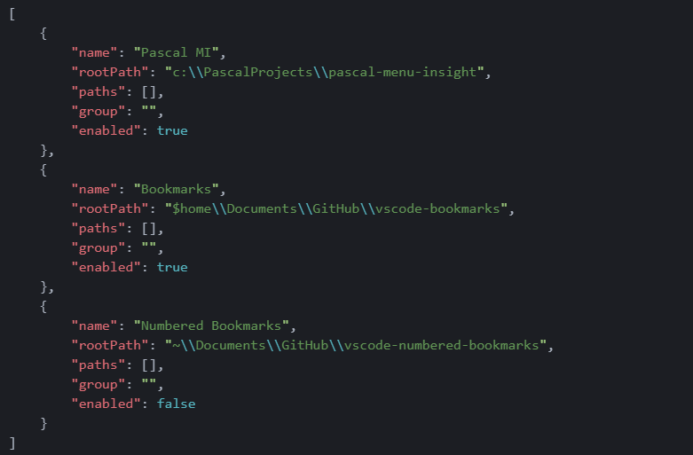
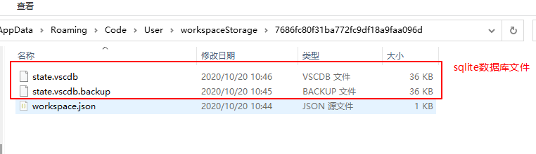

## Project Manager 使用技巧

> 开题：最近使用Project Manager来管理多个项目确实是比较方便的，但是有些地方并不是很完善，所以摸索出来此文

#### 一、Project Manager中直接编辑projects.json添加项目会使得gitlens插件读取的路径错误



* 首先，这里我自己在vscode中重装project manager和gitlens多次都无法解决。所以怀疑不是这里的问题，可能是在添加之后的设置问题

* 猜想设置内容肯定是写到了workspace设置里面，但是打开了workspace setting文件，发现也是空的。这就奇怪了

* 于是一层层找目录文件，才发现workspace的设置数据都保存在了`AppData\Roaming\Code\User\workspaceStorage`路径下




1. 一般这里会有三个文件，前两个`state.vscdb和state.vscdb.backup`一看就知道，肯定是workspace设置数据文件了，打开看了下，果然是sqlite数据库文件

2. 第三个文件`workspace.json`打开看了下：

```json
{
  "folder": "file:///f%3A/Microservices/xyq-account"
}
```

* 可以得知这里只是指明该目录中的对应的workspace路径

* 所以上面是应该是此workspace的设置文件，那是否可以将该设置文件给其他项目使用呢？

**实践一下**

1. 在该workspace下面禁用多个插件，下面称该workspace为`w1`
2. 打开另外一个全新的项目`w2`，此时`AppData\Roaming\Code\User\workspaceStorage`下根据时间排序已经可以看到该新项目`w2`的文件夹了
3. 复制`w1`已经设置好的两个数据库文件`state.vscdb和state.vscdb.backup`到该目录`w2`下
4. 重启vscode，可以看到w2的设置跟w1设置一模一样，果然`state.vscdb和state.vscdb.backup`两个文件就是workspace设置文件